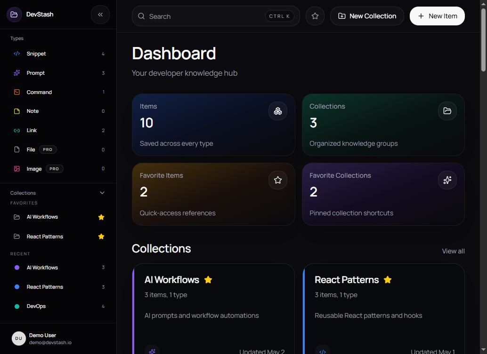

# DevStash

DevStash is a full-stack knowledge hub for developers to save, organize, and reuse snippets, prompts, commands, notes, files, images, and links in one place.

It was built as a portfolio-grade product project: not just a UI mock, but a working Next.js application with authentication, billing gates, uploads, AI-assisted workflows, database-backed search/navigation, and a production-minded data model.



## Why I Built It

Developers collect useful things everywhere: shell history, chat threads, Markdown files, screenshots, gists, bookmarks, and half-finished notes. DevStash explores a simple product question:

How do you turn scattered developer knowledge into a searchable personal workspace that feels fast, structured, and worth returning to?

This project let me work through:

- product design for a developer-focused SaaS workflow
- full-stack feature delivery in Next.js App Router
- authentication and account management flows
- Prisma schema design on Neon Postgres
- subscription-aware feature gating
- file/image handling with Cloudflare R2
- AI features that fit real user workflows instead of feeling bolted on

## What It Does

DevStash supports a mixed-content workspace where a user can:

- save snippets, prompts, notes, commands, files, images, and URLs
- organize items into collections with many-to-many membership
- tag, favorite, pin, and browse content by type
- open and edit items in a reusable right-side drawer
- search items and collections from a global command palette
- upload files and images with gated Free vs Pro behavior
- manage account settings, editor preferences, and billing
- use AI helpers for summaries, tags, code explanations, and prompt optimization

## Highlights

### Product features

- Dashboard with live stats, pinned items, recent items, and collection summaries
- Auth flows for GitHub and email/password sign-in
- Email verification and forgot/reset password flows
- Type-specific creation and editing flows
- Monaco-powered code editor for snippets and commands
- Markdown editor with preview for notes and prompts
- File list and image gallery views
- Favorites, collections, settings, profile, and upgrade flows
- Stripe-based subscription management and feature limits

### Engineering features

- Next.js App Router with server-first data fetching
- Prisma 7 + Neon PostgreSQL
- Auth.js v5 with Prisma adapter
- Zod validation in server actions
- Upstash rate limiting on auth and AI-sensitive routes
- Cloudflare R2 upload/download pipeline with cleanup handling
- Vitest coverage focused on actions, DB helpers, and utilities
- Responsive UI verified in-browser during implementation

## Tech Stack

- Next.js 16
- React 19
- TypeScript
- Tailwind CSS v4
- Prisma 7
- Neon PostgreSQL
- Auth.js v5
- Stripe
- Cloudflare R2
- Upstash Redis / Ratelimit
- Monaco Editor
- Vitest

## Architecture Notes

Some decisions I made on purpose:

- **Server components by default** for data-heavy routes, with client components reserved for editor interactions, dialogs, and command palette behavior.
- **Join tables for tags and collections** so items can belong to multiple collections without bending the data model.
- **Feature gating in application logic** for Free vs Pro limits on items, collections, uploads, and AI flows.
- **A reusable item drawer** shared across dashboard and listing views to keep creation, inspection, and editing behavior consistent.
- **Focused test coverage** around server actions and utility layers, where most of the business logic lives.

## Screens

- `Dashboard`: live workspace overview with collections, pinned items, and recent activity
- `Items by Type`: dedicated listing views for snippets, prompts, notes, commands, files, images, and URLs
- `Collections`: browse and manage grouped knowledge
- `Favorites`: quick access to saved high-value items and collections
- `Settings`: billing, editor preferences, and account-related controls
- `Profile/Auth`: registration, sign-in, verification, password reset, and account management flows

## Local Setup

### Prerequisites

- Node.js 20+
- npm
- A Neon Postgres database

### 1. Install dependencies

```bash
npm install
```

### 2. Configure environment variables

Create a `.env` file with the app's required variables.

Minimum local database setup:

```env
DATABASE_URL=postgres://...
DIRECT_URL=postgres://...
AUTH_SECRET=...
```

Depending on which features you want to run locally, you may also need:

- GitHub OAuth credentials
- Resend email settings
- Stripe keys and price IDs
- Cloudflare R2 credentials
- Upstash Redis credentials
- `MIMO_API_KEY` for AI features

### 3. Generate Prisma client

```bash
npm run prisma:generate
```

### 4. Run migrations

```bash
npm run prisma:migrate:dev
```

### 5. Seed demo data

```bash
npm run db:seed
```

### 6. Start the app

```bash
npm run dev
```

Open `http://localhost:3000`.

## Scripts

```bash
npm run dev
npm run build
npm run start
npm run lint
npm run test
npm run test:watch
npm run db:test
npm run db:seed
npm run prisma:generate
npm run prisma:migrate:dev
npm run prisma:migrate:status
npm run prisma:studio
npm run prisma:validate
```

## Data Model Snapshot

The core schema includes:

- `User`
- `Item`
- `ItemType`
- `Collection`
- `Tag`
- `ItemTag`
- `CollectionItem`
- Auth.js adapter tables for sessions, accounts, and verification tokens

The project uses structured item types plus many-to-many relationships for both tags and collections, which keeps mixed-content retrieval flexible.

## AI Features

AI is treated as a workflow enhancement, not the whole product. Current AI-assisted actions include:

- auto-generating tag suggestions
- generating concise item descriptions
- explaining saved code snippets
- optimizing prompt content

These flows are gated to Pro usage and validated through server actions before write-back.

## Testing

This repo currently emphasizes:

- `npm run lint` for static checks
- `npm run build` for production compilation safety
- `npm run test` for Vitest coverage on server actions and utilities

Component tests are intentionally limited; the most important app logic here sits in actions, data helpers, validation, billing rules, and auth-sensitive flows.

## What I'd Improve Next

If I kept pushing this project, the next areas I would focus on are:

- full-text search ranking beyond the current lightweight command-palette flow
- richer import/export workflows
- stronger automated coverage around billing and upload edge cases
- collaboration or shared workspaces
- a more formal deployment story and seeded demo environment

## Repository Context

This repo also includes internal planning and workflow documentation under [`context/`](./context) and [`AGENTS.md`](./AGENTS.md), which I used to keep feature work scoped and traceable while building.
