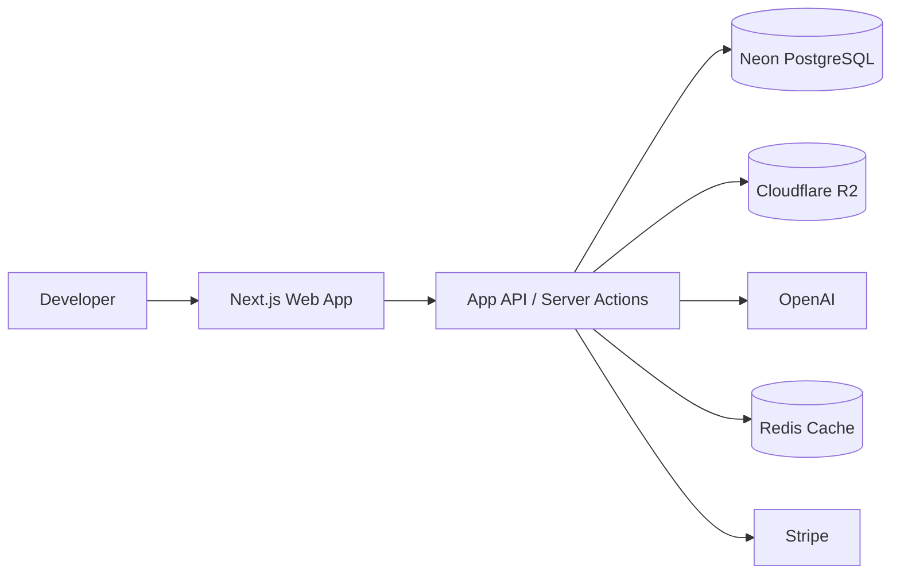
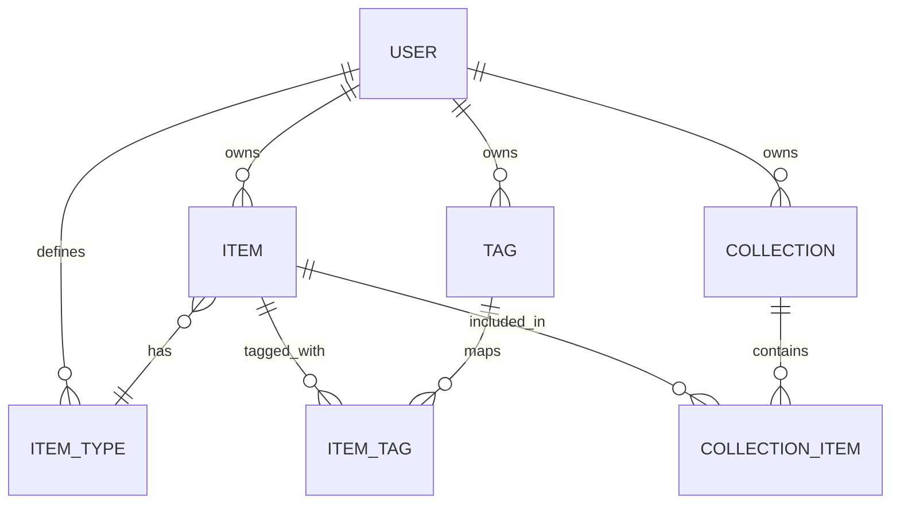
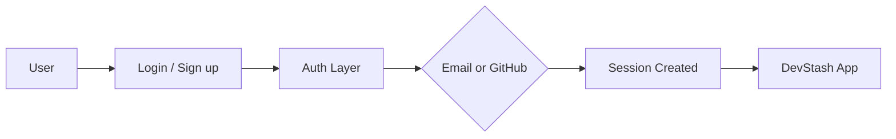
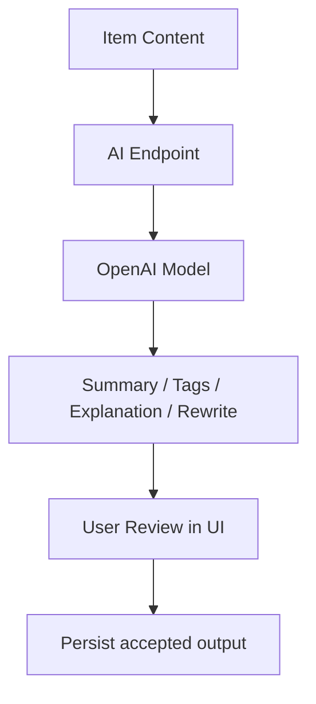

# DevStash — Project Overview

> Centralized developer knowledge hub for snippets, prompts, notes, commands, files, images, and URLs.

## Contents

- [1. Product Summary](#1-product-summary)
- [2. Problem](#2-problem)
- [3. Users and Jobs To Be Done](#3-users-and-jobs-to-be-done)
- [4. Product Scope](#4-product-scope)
- [5. Information Architecture](#5-information-architecture)
- [6. Recommended MVP](#6-recommended-mvp)
- [7. Refined Prisma Data Model](#7-refined-prisma-data-model)
- [8. System Diagrams](#8-system-diagrams)
- [9. API Surface](#9-api-surface)
- [10. UX Notes](#10-ux-notes)
- [11. Plans and Billing](#11-plans-and-billing)
- [12. Build Order](#12-build-order)
- [13. Risks and Open Decisions](#13-risks-and-open-decisions)
- [14. Suggested Repo Structure](#14-suggested-repo-structure)
- [15. Project Links](#15-project-links)

---

## 1. Product Summary

**DevStash** is a searchable, developer-first workspace for storing and reusing:

- 💻 code snippets
- 🤖 AI prompts
- 📝 notes and docs
- ⌨️ terminal commands
- 📎 uploaded files
- 🖼️ images
- 🔗 URLs and references

### Positioning

Developers already save useful things everywhere. DevStash turns that scattered knowledge into one indexed workspace with optional AI assistance.

### Value proposition

- Faster retrieval of dev knowledge
- Less context switching
- Better reuse of prompts, snippets, commands, and docs
- Cleaner personal workflows across projects

### One-line pitch

**Store smarter. Retrieve faster. Reuse everything.**

---

## 2. Problem

Developer knowledge is fragmented across tools and surfaces:

- snippets in editors or gists
- prompts in chats
- notes in Notion or markdown files
- commands in shell history or text files
- docs in random folders
- links in bookmarks
- context files buried inside repos

### Resulting pain

- repeated searching
- duplicated work
- poor reuse of proven solutions
- missing context during coding sessions
- inconsistent personal systems

### Product response

DevStash provides **one searchable, structured, AI-assisted hub** for personal developer knowledge.

---

## 3. Users and Jobs To Be Done

| User | Primary job | Success criteria |
|---|---|---|
| Everyday Developer | Find snippets, commands, links quickly | Search returns useful result in seconds |
| AI-First Developer | Store prompts, workflows, context packs | Prompts are reusable and tagged |
| Educator / Creator | Save teaching notes and demo code | Materials are organized by topic |
| Full-Stack Builder | Keep patterns, templates, API references | Boilerplates and references stay easy to reuse |

### Core JTBD statements

- “When I solve something once, I want to save it in a way I can actually find later.”
- “When I switch projects, I want my commands, prompts, and reference material ready without digging through old chats or repos.”
- “When I search, I want results across all item types, not six different tools.”

---

## 4. Product Scope

## Core entities

### 📦 Item
A saved unit of knowledge.

Examples:
- snippet
- prompt
- note
- command
- file
- image
- URL

### 🗂️ Collection
A named grouping of items.

Examples:
- React Patterns
- Prompt Packs
- Terminal Recipes
- Context Files

### 🏷️ Tag
Lightweight labeling for search and filtering.

Examples:
- react
- auth
- postgres
- interview
- cli

### 🧩 Item Type
Defines built-in and custom item types.

Built-in examples:
- Snippet
- Prompt
- Note
- Command
- File
- Image
- URL

Custom item types are a Pro feature.

---

## 5. Information Architecture

## Recommended content model

Your original structure is close, but one relationship needs changing:

- `Item -> Collection` as a nullable foreign key limits each item to **one** collection.
- For a knowledge product, items usually need to appear in **multiple** collections.

### Recommendation
Use a join table:

- `CollectionItem`

This gives:
- many-to-many item membership
- ordered collections later
- easy “pin this item to multiple collections” support

### Recommended domain rules

- Every item belongs to exactly one user.
- Every collection belongs to exactly one user.
- Every tag belongs to exactly one user.
- Tags are many-to-many with items.
- Collections are many-to-many with items.
- Item types can be:
  - system-defined
  - user-defined
- Search indexes title, description, content, tags, and type metadata.

---

## 6. Recommended MVP

## In scope

- User auth
- Item CRUD
- Collection CRUD
- Tagging
- Full-text search
- Favorites and pinned state
- Recent activity tracking
- Basic file upload
- Free vs Pro gating

## Out of scope for first release

- shared workspaces
- org/team accounts
- browser extension
- VS Code extension
- API/CLI
- advanced import pipelines
- collaborative editing

## MVP success criteria

- User can create and edit items quickly
- Search works across mixed item types
- File uploads are reliable
- Retrieval is faster than the user’s old workflow
- Free tier feels useful, Pro tier has a clear upgrade path

---

## 7. Refined Prisma Data Model

This version keeps your core idea, but tightens the model for growth.

### Notes

- Uses join tables for tags and collections
- Supports built-in and custom item types
- Keeps AI metadata optional
- Keeps auth adapter tables out of the core schema for readability
- Assumes billing fields stay on `User` for the first version

```prisma
enum Plan {
  FREE
  PRO
}

enum ItemContentMode {
  TEXT
  FILE
  URL
}

model User {
  id                   String        @id @default(cuid())
  email                String        @unique
  passwordHash         String?
  name                 String?
  image                String?

  plan                 Plan          @default(FREE)
  stripeCustomerId     String?       @unique
  stripeSubscriptionId String?       @unique
  stripePriceId        String?

  items                Item[]
  itemTypes            ItemType[]
  collections          Collection[]
  tags                 Tag[]

  createdAt            DateTime      @default(now())
  updatedAt            DateTime      @updatedAt
}

model Item {
  id                   String           @id @default(cuid())
  userId               String
  typeId               String

  title                String
  description          String?
  contentMode          ItemContentMode

  // TEXT content
  content              String?

  // FILE content
  fileUrl              String?
  fileKey              String?
  fileName             String?
  fileMimeType         String?
  fileSizeBytes        Int?

  // URL content
  url                  String?

  language             String?
  isFavorite           Boolean          @default(false)
  isPinned             Boolean          @default(false)
  lastAccessedAt       DateTime?

  // Optional AI metadata
  aiSummary            String?
  aiTagStatus          String?

  user                 User             @relation(fields: [userId], references: [id], onDelete: Cascade)
  type                 ItemType         @relation(fields: [typeId], references: [id], onDelete: Restrict)

  tags                 ItemTag[]
  collections          CollectionItem[]

  createdAt            DateTime         @default(now())
  updatedAt            DateTime         @updatedAt

  @@index([userId, updatedAt])
  @@index([userId, isFavorite])
  @@index([userId, isPinned])
}

model ItemType {
  id                   String           @id @default(cuid())
  userId               String?

  key                  String           @unique
  name                 String
  icon                 String?
  color                String?
  contentMode          ItemContentMode
  isSystem             Boolean          @default(false)

  user                 User?            @relation(fields: [userId], references: [id], onDelete: Cascade)
  items                Item[]

  @@unique([userId, name])
}

model Collection {
  id                   String           @id @default(cuid())
  userId               String

  name                 String
  description          String?
  isFavorite           Boolean          @default(false)

  user                 User             @relation(fields: [userId], references: [id], onDelete: Cascade)
  items                CollectionItem[]

  createdAt            DateTime         @default(now())
  updatedAt            DateTime         @updatedAt

  @@unique([userId, name])
  @@index([userId, updatedAt])
}

model Tag {
  id                   String           @id @default(cuid())
  userId               String

  name                 String
  color                String?

  user                 User             @relation(fields: [userId], references: [id], onDelete: Cascade)
  items                ItemTag[]

  @@unique([userId, name])
}

model ItemTag {
  itemId               String
  tagId                String

  item                 Item             @relation(fields: [itemId], references: [id], onDelete: Cascade)
  tag                  Tag              @relation(fields: [tagId], references: [id], onDelete: Cascade)

  @@id([itemId, tagId])
  @@index([tagId])
}

model CollectionItem {
  collectionId         String
  itemId               String
  sortOrder            Int              @default(0)
  addedAt              DateTime         @default(now())

  collection           Collection       @relation(fields: [collectionId], references: [id], onDelete: Cascade)
  item                 Item             @relation(fields: [itemId], references: [id], onDelete: Cascade)

  @@id([collectionId, itemId])
  @@index([itemId])
  @@index([collectionId, sortOrder])
}
```

### Optional auth adapter models

If using an auth adapter, add provider/session models separately so the core domain stays readable.

### Search implementation note

For PostgreSQL, plan for either:

- Prisma + SQL for `tsvector` full-text search, or
- a dedicated search service later if relevance becomes a bottleneck

---

## 8. System Diagrams

## High-level architecture



## Core entity relationships



## Auth flow



## AI feature flow



---

## 9. API Surface

A clean REST or route-handler layout is enough for v1.

### Example routes

#### Auth
- `POST /api/auth/signup`
- `POST /api/auth/login`
- `POST /api/auth/logout`

#### Items
- `GET /api/items`
- `POST /api/items`
- `GET /api/items/:id`
- `PATCH /api/items/:id`
- `DELETE /api/items/:id`

#### Collections
- `GET /api/collections`
- `POST /api/collections`
- `PATCH /api/collections/:id`
- `DELETE /api/collections/:id`
- `POST /api/collections/:id/items`
- `DELETE /api/collections/:id/items/:itemId`

#### Tags
- `GET /api/tags`
- `POST /api/tags`
- `PATCH /api/tags/:id`
- `DELETE /api/tags/:id`

#### Search
- `GET /api/search?q=...`

#### Files
- `POST /api/uploads/presign`
- `POST /api/uploads/complete`

#### AI
- `POST /api/ai/summarize`
- `POST /api/ai/auto-tag`
- `POST /api/ai/explain-code`
- `POST /api/ai/optimize-prompt`

#### Billing
- `POST /api/billing/create-checkout-session`
- `POST /api/billing/customer-portal`
- `POST /api/webhooks/stripe`

---

## 10. UX Notes

## Design principles

- 🌙 dark-mode first
- ⚡ keyboard-friendly interaction
- 🧠 fast retrieval over visual clutter
- 🧱 consistent item editor across types
- 🔎 search visible at all times on desktop

## Recommended layout

### Left sidebar
- collections
- type filters
- tags
- favorites
- recent

### Main area
- result list or grid
- sort and filter controls
- quick actions

### Right panel or modal
- item detail / editor
- metadata
- AI actions

## Nice-to-have interactions

- command-click or keyboard shortcut to open item in editor
- quick copy for snippets/commands/prompts
- inline markdown preview
- syntax highlighting for code
- drag-to-reorder inside collections

---

## 11. Plans and Billing

| Plan | Price | Limits | Included |
|---|---:|---|---|
| Free | $0 | 50 items, 3 collections | Core CRUD, search, tags, image/file basics |
| Pro | $8/mo or $72/yr | Higher or unlimited limits | AI tools, custom types, export, larger uploads |

### Gating recommendation

#### Free
- fixed item limit
- fixed collection limit
- built-in item types only
- no AI or very limited AI trial credits

#### Pro
- higher storage limit
- AI features
- custom item types
- export/import improvements
- future advanced integrations

---

## 12. Build Order

## Phase 1 — foundation

- Next.js app scaffold
- Tailwind + component system
- Prisma + Neon setup
- auth setup
- base layout and navigation

## Phase 2 — core product

- item CRUD
- collection CRUD
- tag system
- list/detail/editor views
- pinned/favorite states

## Phase 3 — retrieval

- search endpoint
- filter by type/tag/collection
- recent activity tracking
- copy actions for snippets and commands

## Phase 4 — storage and billing

- R2 uploads
- item file metadata
- Stripe checkout + webhook sync
- free/pro limits in middleware or service layer

## Phase 5 — AI layer

- summarize
- auto-tag
- explain code
- prompt optimization
- usage metering

---

## 13. Risks and Open Decisions

## Product decisions still worth locking down

1. **Collection membership**  
   Decide whether one item can belong to multiple collections. This overview assumes **yes**.

2. **Search strategy**  
   Decide whether PostgreSQL full-text search is enough for v1. It usually is.

3. **File ingestion**  
   Decide whether uploaded files should be searchable by metadata only, or by extracted text later.

4. **AI write-back policy**  
   Decide whether AI outputs auto-save or require explicit user confirmation. Recommended: **user confirms before save**.

5. **Custom item types**  
   Decide whether custom types affect only label/icon or also editor behavior. Recommended for v1: **label/icon/filter only**.

6. **Export scope**  
   Decide whether export includes binary files, metadata only, or full workspace zip. Recommended for v1: **JSON + referenced files in zip**.

## Technical risks

- upload edge cases on large files
- low-quality search relevance if indexing is weak
- billing state drift without solid Stripe webhook handling
- AI cost creep if requests are not rate-limited and cached
- schema churn if custom types become too dynamic too early

---

## 14. Suggested Repo Structure

```text
apps/
  web/
    app/
    components/
    features/
      auth/
      items/
      collections/
      tags/
      search/
      billing/
      ai/
    lib/
      auth/
      db/
      storage/
      stripe/
      ai/
    prisma/
      schema.prisma
    public/

packages/
  ui/
  config/
  types/
```

For a single-app start, keep it simpler and split features only when the codebase starts repeating itself.

---

## 15. Project Links

## Internal placeholders

- [Product summary](#1-product-summary)
- [Refined Prisma data model](#7-refined-prisma-data-model)
- [System diagrams](#8-system-diagrams)
- [Build order](#12-build-order)
- [Risks and open decisions](#13-risks-and-open-decisions)

## External links to add later

- GitHub repository
- Production app URL
- Figma file
- API collection / OpenAPI spec
- Stripe dashboard notes
- Database ERD screenshot

---

## Appendix — Seeded system item types

Suggested initial seeded item types:

| key | name | contentMode | icon suggestion |
|---|---|---|---|
| `snippet` | Snippet | `TEXT` | `code-2` |
| `prompt` | Prompt | `TEXT` | `sparkles` |
| `note` | Note | `TEXT` | `file-text` |
| `command` | Command | `TEXT` | `terminal` |
| `file` | File | `FILE` | `paperclip` |
| `image` | Image | `FILE` | `image` |
| `url` | URL | `URL` | `link` |

---

## Status

- Planning complete enough for environment setup
- Schema direction is clear enough for CRUD implementation
- Next useful milestone: **auth + Prisma + item CRUD + collection join model**
